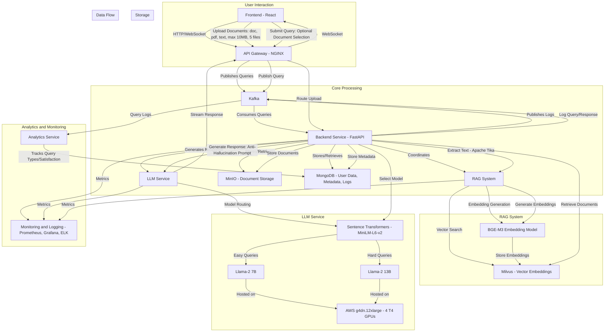

# Customer Support Chatbot System Design Document


## 1. Architecture Diagram

The system architecture is modular, scalable, and optimized for real-time performance. Below is a textual representation of the architecture, detailing components and data flow.

**Components**:
- **Frontend (React)**: A web interface built with [React](https://reactjs.org/) for user interaction, including chat and document uploads.
- **API Gateway (NGINX)**: Manages HTTP requests and WebSocket connections for real-time chat streaming, using [NGINX](https://nginx.org/).
- **Kafka**: A message broker for real-time query streams and logging, implemented with [Apache Kafka](https://kafka.apache.org/).
- **Backend Service (FastAPI)**: Processes queries, handles document uploads, and coordinates with other services, built with [FastAPI](https://fastapi.tiangolo.com/).
- **LLM Service**: Runs fine-tuned Llama-2 7B and 13B models on AWS g4dn.12xlarge instances, optimized with [vLLM](https://vllm.ai/) for efficient inference.
- **RAG System**: Retrieves relevant documentation using [Milvus](https://milvus.io/) for vector search and BGE-M3 for embeddings.
- **Databases**:
  - **MinIO**: Stores uploaded documents, implemented with [MinIO](https://min.io/).
  - **Milvus**: Stores document embeddings for RAG.
  - **MongoDB**: Stores user data, document metadata, and logs, using [MongoDB](https://www.mongodb.com/).
- **Analytics Service**: Tracks query types and user satisfaction by consuming Kafka streams.
- **Monitoring & Logging**: Uses [Prometheus](https://prometheus.io/) and [Grafana](https://grafana.com/) for system health monitoring.

**Data Flow**:
1. **Document Upload**:
   - Users upload up to 5 documents (doc, pdf, text, max 10 MB each) via the Frontend.
   - The API Gateway routes the request to the Backend Service.
   - The Backend Service stores files in MinIO, extracts text using [Apache Tika](https://tika.apache.org/), generates embeddings with BGE-M3, and stores embeddings in Milvus and metadata in MongoDB.
2. **Query Processing**:
   - Users submit queries via the Frontend, optionally selecting specific documents.
   - The API Gateway publishes queries to a Kafka topic.
   - The Backend Service consumes from Kafka:
     - Retrieves top-k documents from Milvus, filtered by selected documents if specified.
     - Uses sentence-transformers/all-MiniLM-L6-v2 to compute query-context similarity for model routing (Llama-7B for high similarity, Llama-13B for low).
     - Generates a response with the chosen LLM, using retrieved documents as context.
     - If no relevant documents are found (low similarity score), informs the user: "No relevant information was found in the selected documents."
   - Responses are streamed back to the Frontend via WebSockets.
3. **Analytics and Logging**:
   - Queries and responses are logged to Kafka for the Analytics Service to track query types and satisfaction.
   - Monitoring tools track system performance and latency.

**Textual Diagram**:
```
[Frontend (React)] --> [API Gateway (NGINX)] --> [Kafka] --> [Backend Service (FastAPI)]
                                                   |--> [RAG System] --> [Milvus]
                                                   |--> [LLM Service] --> [g4dn.12xlarge]
                                                   |--> [MinIO]
                                                   |--> [MongoDB]
                                                   |--> [Analytics Service]
                                                   |--> [Monitoring & Logging]
```

**Detail Flow**



## 2. Model Selection Justification

**Models**:
- **Chat Model**: Llama-2 (7B and 13B) from [Meta AI](https://ai.meta.com/llama/).
- **Embedding Model**: BGE-M3 from [Hugging Face](https://huggingface.co/BAAI/bge-m3).
- **Model Routing**: sentence-transformers/all-MiniLM-L6-v2 from [Hugging Face](https://huggingface.co/sentence-transformers/all-MiniLM-L6-v2).

**Justification**:
- **Llama-2**:
  - Offers strong performance in natural language tasks and supports multilingual capabilities, including English and Vietnamese.
  - Open-source, ensuring data privacy through internal hosting.
  - Fine-tunable with tools like [Unsloth](https://github.com/unslothai/unsloth) for efficient customization.
  - Model routing optimizes resource usage: Llama-7B for easier queries (high query-context similarity) and Llama-13B for harder queries (low similarity).
- **BGE-M3**:
  - A multilingual embedding model supporting over 100 languages, including English and Vietnamese, ideal for RAG in diverse linguistic contexts.
  - Excels in dense, multi-vector, and sparse retrieval, enhancing document retrieval accuracy.
- **sentence-transformers/all-MiniLM-L6-v2**:
  - Lightweight model for computing query-context similarity to determine query difficulty.
  - High similarity indicates an easier query (Llama-7B), while low similarity escalates to Llama-13B.

**Fine-Tuning**:
- Llama-2 will be fine-tuned on company documentation using question-answer pairs derived from the documents.
- Periodic fine-tuning ensures alignment with updated documentation.

**Alternatives**:
- Models like Qwen and DeepSeek were considered but not selected due to Llama-2’s robust ecosystem and proven RAG performance.

## 3. RAG Implementation Details

**Purpose**:
- The Retrieval-Augmented Generation (RAG) system ensures responses are grounded in company documentation, minimizing hallucinations.

**Components**:
- **Vector Database**: Milvus for efficient vector search.
- **Embedding Model**: BGE-M3 for generating multilingual embeddings.
- **Framework**: [LlamaIndex](https://www.llamaindex.ai/) or [RAGFlow](https://github.com/infiniflow/ragflow) for streamlined RAG workflows.

**Implementation**:
1. **Document Upload and Processing**:
   - Users upload documents (doc, pdf, text, max 10 MB, 5 at a time) via the React Frontend.
   - The Backend Service:
     - Stores files in MinIO.
     - Extracts text using Apache Tika, supporting doc, pdf, and text formats.
     - Splits text into chunks (e.g., paragraphs).
     - Generates embeddings with BGE-M3.
     - Stores embeddings in Milvus with document IDs for filtering and metadata in MongoDB (e.g., filename, upload date, user ID).
2. **Query Processing**:
   - Users submit queries, optionally selecting specific documents.
   - The Backend Service:
     - Converts the query to an embedding using BGE-M3.
     - Retrieves top-k documents from Milvus, filtered by selected document IDs if specified.
     - Computes similarity between query and retrieved documents using sentence-transformers/all-MiniLM-L6-v2.
     - Selects Llama-7B (similarity > threshold, e.g., 0.8) or Llama-13B (below threshold).
     - Passes query, retrieved documents, and anti-hallucination prompt to the LLM: "Answer based only on the provided context. If you don’t know, say ‘I don’t know.’"
     - If no relevant documents are found (similarity below threshold, e.g., 0.3), returns: "No relevant information was found in the selected documents."
   - Responses are streamed via WebSockets for real-time interaction.
3. **Hallucination Prevention**:
   - Users can select specific documents to limit retrieval scope.
   - Anti-hallucination prompts enforce context-based responses.
   - Low-similarity document retrieval triggers user notification.

**Optimizations**:
- **Two-Step Retrieval**: Coarse-to-fine retrieval for improved precision.
- **Regular Updates**: Schedule updates to Milvus for new or modified documents.
- **Caching**: Cache frequent queries to reduce LLM calls.

**Challenges**:
- **Irrelevant Retrieval**: Mitigated by fine-tuning BGE-M3 and allowing document selection.
- **No Relevant Documents**: Handled by user notification and fallback to human support.

## 4. Deployment Strategy

**Infrastructure**:
- **LLM Service**: Deployed on AWS g4dn.12xlarge instances (4 NVIDIA T4 GPUs each, 16 GB memory) for efficient inference with 4-bit quantization.
- **Other Components**: Standard EC2 instances (e.g., m5.large for Backend, t3.medium for databases).
- **Containerization**: All services use [Docker](https://www.docker.com/) for portability.
- **Orchestration**: [Kubernetes](https://kubernetes.io/) manages deployment, scaling, and load balancing.

**Scalability**:
- **Horizontal Scaling**: Deploy multiple g4dn.12xlarge instances (5 estimated) to handle 100+ concurrent users.
- **Auto-Scaling**: Kubernetes scales based on CPU/memory usage or query volume.
- **Load Balancing**: NGINX distributes traffic across Backend and LLM services.

**Low Latency**:
- **Geographic Proximity**: Deploy in an AWS region close to the user base (e.g., ap-southeast-1 for Southeast Asia).
- **GPU Optimization**: Use vLLM with PagedAttention for concurrent query processing.
- **RAG Efficiency**: Optimize Milvus for sub-0.1-second vector searches.

**Performance Estimates**:
- **Hardware**: g4dn.12xlarge (4 T4 GPUs) vs. A100 40GB:
  - **T4 GPU**: With 4-bit quantization, Llama-7B achieves ~100 tokens/second, Llama-13B ~50 tokens/second. Each GPU handles ~5 concurrent queries (1.5–2 seconds latency).
  - **A100 40GB**: Higher throughput (~200 tokens/second for Llama-7B, ~100 for 13B), ~10 concurrent queries per GPU, but more expensive.
- **Concurrency**: 5 g4dn.12xlarge instances (20 T4 GPUs) handle 20 × 5 = 100 concurrent queries, meeting the requirement.
- **Latency Breakdown**:
  - Retrieval (Milvus): ~0.1 seconds.
  - Generation (Llama-7B/13B): ~1.5 seconds for 100 input + 100 output tokens.
  - Total: ~1.6 seconds, under 2 seconds.

**Cost-Effectiveness**:
- **Instance Selection**: g4dn.12xlarge chosen for cost-performance balance ($3.932/hour).
- **Quantization**: 4-bit quantization reduces memory usage, enabling T4 GPUs to run Llama-13B.
- **Spot Instances**: Use AWS spot instances for non-critical workloads.
- **Caching and Batching**: Reduce LLM calls and optimize GPU utilization.

**Deployment Steps**:
1. Containerize services using Docker.
2. Deploy on a Kubernetes cluster with auto-scaling.
3. Configure NGINX for HTTP and WebSocket support.
4. Conduct load testing for 100+ concurrent users.
5. Optimize latency and costs based on monitoring data.

## 5. Monitoring and Evaluation Plan

**Monitoring**:
- **System Health**: Prometheus and Grafana track CPU, memory, GPU usage, and latency.
- **Logs**: [ELK Stack](https://www.elastic.co/elastic-stack) for centralized logging and debugging.
- **Performance Metrics**:
  - Latency: Ensure <2 seconds per response.
  - Throughput: Track queries per second for scalability.
  - Error Rates: Monitor failures in Backend, LLM, or RAG systems.

**Evaluation**:
- **Query Types**: Categorize queries using NLP-based classification (e.g., keyword extraction).
- **User Satisfaction**: Implement feedback mechanisms (e.g., rating buttons, surveys).
- **Model Performance**: Evaluate LLM accuracy on a held-out query set, monitoring for documentation drift.

**Tools**:
- Prometheus and Grafana for real-time monitoring.
- Custom analytics pipeline via Kafka for query and satisfaction tracking.
- Periodic manual audits for response quality.

## 6. Cost Estimation and Optimization

**Cost Components**:
| Component              | Description                                      | Estimated Cost (Monthly) |
|------------------------|--------------------------------------------------|--------------------------|
| LLM Service           | 5 x g4dn.12xlarge ($3.932/hour)                 | ~$1,417                  |
| Backend Service       | 2 x m5.large ($0.14/hour)                       | ~$201                    |
| MongoDB               | t3.medium ($0.023/hour)                         | ~$16.52                  |
| MinIO                 | t3.medium ($0.023/hour)                         | ~$16.52                  |
| Milvus                | m5.large ($0.14/hour)                           | ~$100.8                  |
| Kafka                 | 3 x m5.large ($0.42/hour total)                 | ~$301.44                 |
| Analytics & Monitoring| t3.medium ($0.023/hour)                         | ~$16.52                  |
| **Total**             |                                                  | **~$2,069.8**            |

**Optimization Strategies**:
- **Model Quantization**: Use 4-bit quantization to reduce GPU memory requirements.
- **Prompt Optimization**: Use concise prompts to minimize token usage.
- **Caching**: Cache frequent queries to reduce LLM calls.
- **Batching**: Leverage vLLM’s PagedAttention for efficient query batching.
- **Spot Instances**: Use AWS spot pricing for non-critical workloads.
- **Resource Monitoring**: Use [Cast AI](https://cast.ai/) for cost optimization.

**A100 40GB Alternative**:
- A100 40GB GPUs (e.g., in p4d.24xlarge, $38.896/hour) offer higher throughput but increase costs significantly (~$5,600/month for 2 instances).
- T4 GPUs are preferred for cost-effectiveness, with sufficient performance via quantization.

## 7. Potential Challenges and Mitigation

| Challenge                          | Description                                              | Mitigation Strategy                                                                 |
|------------------------------------|----------------------------------------------------------|-------------------------------------------------------------------------------------|
| Irrelevant Document Retrieval     | RAG retrieves unrelated documents                        | Fine-tune BGE-M3, use relevance feedback, and allow document selection.              |
| No Relevant Documents             | No documents match the query                             | Notify user: "No relevant information was found in the selected documents."          |
| Model Outdated                    | Documentation changes affect response accuracy           | Automate periodic fine-tuning with new documentation.                                |
| Peak Load Scalability             | High concurrency degrades performance                    | Use Kubernetes auto-scaling and conduct load testing.                                |
| Security and Privacy              | Sensitive company data at risk                           | Encrypt data at rest and in transit, restrict access to internal networks.           |
| Cost Overruns                     | Unexpectedly high infrastructure costs                   | Monitor costs with observability tools and optimize resource usage.                  |

